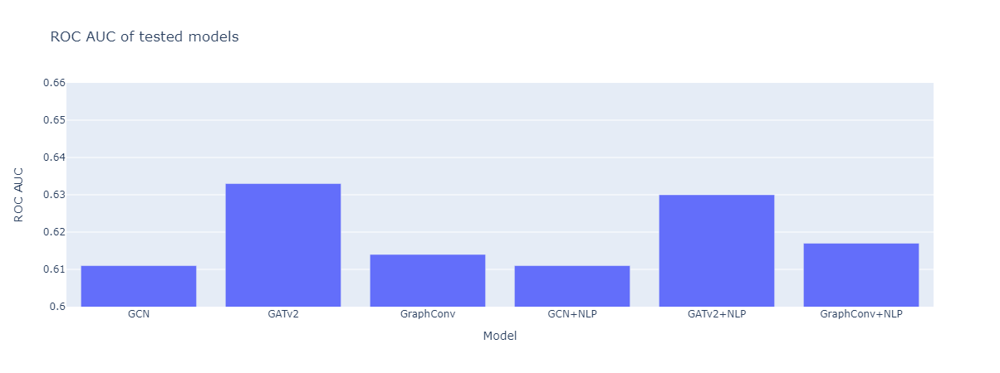

# Wikidata5m Graph Machine Learning

## Abstract:

Wikipedia5m is a subset of the Wikipedia knowledge graph. Wikipedia's knowledge graph is mostly created by hand, by thousands of volunteers without automation. I will try to use Graph Machine Learning methods to predict links between entities, which could make the tagging easier, perhaps fully autonomous in the future. Sentence embeddings of each entity are then added to see if the context provides further improvement in classification. The hypothesis is that sentence embeddings will add information to the network, which will improve classification.
### Contributions
I have written a custom PyG dataset loader, which downloads data from source, preprocesses it and creates a PyG graph. I have tested multiple models, with and without sentence embeddings to assess differences in speed, memory and final performance.

## Dataset: Wikidata5m

Wikidata5m is a knowledge graph dataset, which integrates the Wikidata knowledge graph and Wikipedia texts.

The dataset can be found at [https://deepgraphlearning.github.io/project/wikidata5m](https://deepgraphlearning.github.io/project/wikidata5m).

I am using the transductive version, which has 4,5M+ entities, 822 relations and 20M+ edges.

## Link prediction

Link prediction is a problem of predicting if a link (edge) exists between two nodes in a graph. 
Common tasks are:
- Predicting friendships in social networks
- Recommending items to users
- Bonds between molecules in proteins

Link prediction is traditionally done using pairs of nodes, we predict if there exists an edge between them.
The original nodes are infused with negative samples of edges and the model's task is to predict the true edges, while disregarding the negative edges.

## Dataset preprocessing

To work comfortably with the data, I wrote a PyG dataset, concretely `InMemoryDataset`, which downloads all the needed files and preprocesses them to finally get a PyG graph.

The dataset can then be used as follows:

```python
from torch_wikidata import Wikidata5m

dataset = Wikidata5m("datasets/")
```

or if one want's to use sentence embeddings

```python
dataset = Wikidata5m("datasets/", use_embeddings=True, embeddings_file=path_to_embeddings)
```

## Working with large graphs

Because the knowledge graph is very large, one of the main challenges is even getting the graph to memory.

I am using PyG's [LinkNeighborLoader](https://pytorch-geometric.readthedocs.io/en/latest/modules/loader.html#torch_geometric.loader.LinkNeighborLoader), which uses GraphSAGE under the hood to sample the edges.

We can then use traditional batching to train and test the model.

```python
for batch in data_loader:
    ...
```

## Model parameters
- batch_size = `1024`
- n_neighbors=`[15] * 2`
- hidden_channels = `256`
- output_channels = `256`
- embedding_size = `384`
- n_epochs = `3`
- lr = `1e-2`

My error metric is ROC AUC, metric for training is Binary Cross Entropy

## Using embeddings from Wikipedia articles

I have used SentenceTransformers to get the embeddings, because of the size of the data, I used the fastest available model for inference.

```python
SentenceTransformer('paraphrase-MiniLM-L3-v2')
```

## Results

### Layers used:
- [GCN](https://pytorch-geometric.readthedocs.io/en/latest/generated/torch_geometric.nn.conv.GCNConv.html#torch_geometric.nn.conv.GCNConv)
- [GATv2](https://pytorch-geometric.readthedocs.io/en/latest/generated/torch_geometric.nn.conv.GATv2Conv.html#torch_geometric.nn.conv.GATv2Conv)
- [GraphConv](https://pytorch-geometric.readthedocs.io/en/latest/generated/torch_geometric.nn.conv.GraphConv.html#torch_geometric.nn.conv.GraphConv)

Remarks: Authors of the GAT layer suggest using the new GATv2 layer for better performance.



All of the networks are composed of 2 same layers, using `relu` and dropout = `0.5` on the first layer.
GAT layers were the least stable, achieving vastly different results across epochs. They would need longer training, but to keep the limits for speed and memory comparisons, I used the same ammount of epochs for all models.

Device                       | GCN        | GATv2       | GraphConv   | GCN+NLP     | GATv2+NLP   | GraphConv+NLP     |
|----------------------------|------------|-------------|-------------|-------------|-------------|-------------|
|Training time / epoch (min) | __06:00__  | 08:00       | 09:07       | 08:37       | 10:08       | 08:40       |
| Memory used (GB)           | 0.79       | 2.6         | __0.54__    | 0.86        | 2.77        | 0.76        |
| ROC AUC                    | 0.611      | __0.633__   | 0.614       | 0.611       | 0.630       | 0.617       |

A T4 GPU was used for training. CPU (Intel i5, 11th gen) performance was 10-15x slower across all network layers.

Library versions:
- PyG: `2.2.0`
- Pytorch: `1.13.1`
- Pytorch-sparse: `0.6.16`
- Pytorch-scatter: `2.1.0`

### Reproducibility
To recreate the results, create a new conda environment:
```python
conda env create -f environment.yml
```
And run the corresponding notebooks.

## Conclusion

My hypothesis was not confirmed, models with embeddings did not show better performance. There can be several possible explanations for this. Embeddings might not be correctly trained, or they can be mismatched with the edges, although I have tried to avoid this. Some of the entities also do not have a wikipedia page, so a uniform tensor was used, which provides potentially conflicting information to the model.
Among the models, GAT was expected to be the best performing, which we can be seen in the results, at the cost of substantially higher memory.

## Sources

- [PyG documentation](https://pytorch-geometric.readthedocs.io/en/latest/index.html)
- [Link prediction example](https://github.com/pyg-team/pytorch_geometric/blob/master/examples/link_pred.py)